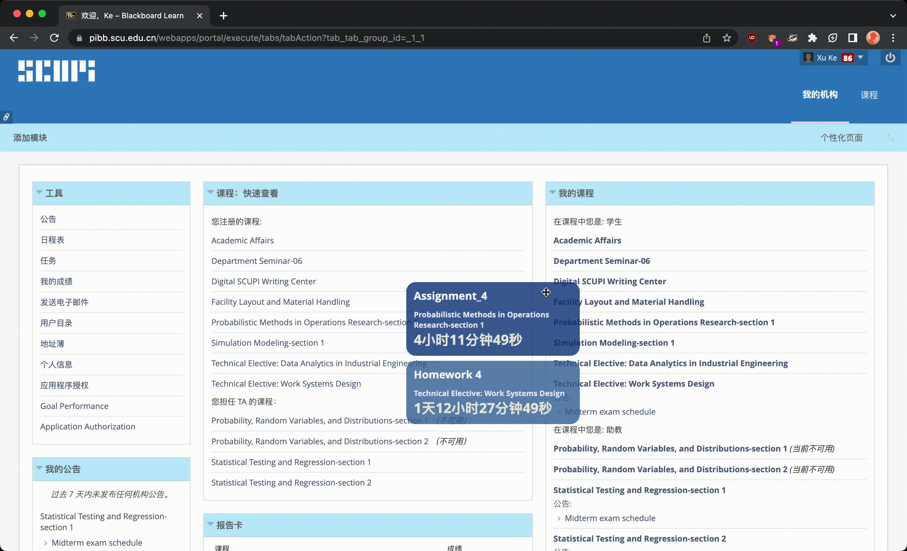
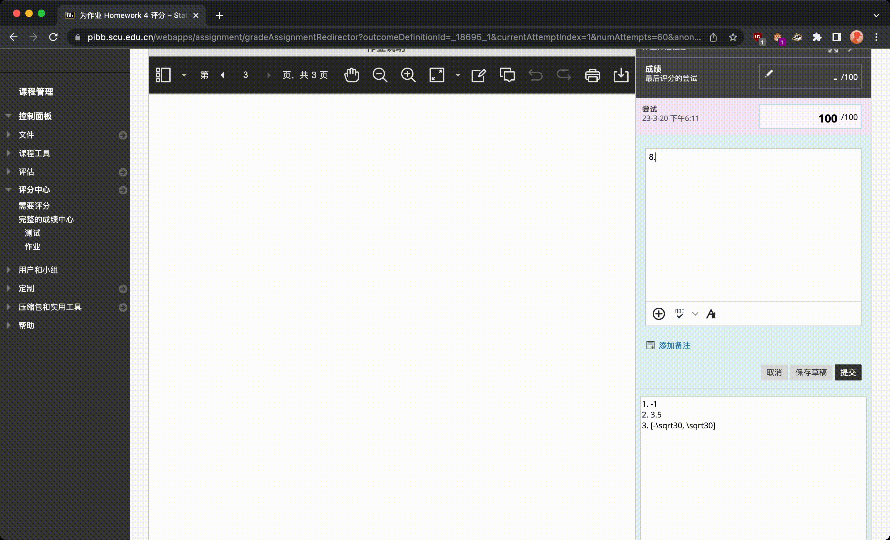

<h1 align="center">Bb 增强 | Blackboard Enhanced</h1>

<h3>

[安装](#安装) | [功能介绍](#功能介绍) | [历史版本](#历史版本)

</h3>

四川大学匹兹堡学院**Blackboard**增强插件
****
## 安装 

### 1. 安装油猴软件

  |浏览器|暴力猴（推荐）|油猴|
  |:---:|:----:|:-----:|
  |Chrome| [安装](https://chrome.google.com/webstore/detail/violentmonkey/jinjaccalgkegednnccohejagnlnfdag?hl=zh-CN)|[安装](https://chrome.google.com/webstore/detail/tampermonkey/dhdgffkkebhmkfjojejmpbldmpobfkfo?hl=zh-CN)|
  |Edge|[安装](https://microsoftedge.microsoft.com/addons/detail/%E6%9A%B4%E5%8A%9B%E7%8C%B4/eeagobfjdenkkddmbclomhiblgggliao?hl=zh-CN)|[安装](https://microsoftedge.microsoft.com/addons/detail/tampermonkey/iikmkjmpaadaobahmlepeloendndfphd)|
  |Firefox|[安装](https://addons.mozilla.org/en-US/firefox/addon/violentmonkey/)|[安装](https://addons.mozilla.org/en-US/firefox/addon/tampermonkey/?utm_source=addons.mozilla.org&utm_medium=referral&utm_content=search)|

 

### 2. 安装脚本：跳转 [**GreasyFork**](https://greasyfork.org/zh-CN/scripts/462240-bb%E8%AE%A1%E7%AE%97%E5%88%86%E6%95%B0) 安装

### 3. 打开**Blackboard**开始使用

****
## 功能介绍 
### DDL海报
Bb首页显示日程悬浮海报与倒计时，点击课程名称直接跳转至对应课程。

 

### 作业批改 - 扣分统计
在“给学习者的反馈”窗口输入扣分情况。格式：**在“-”后输入扣的分值**。脚本会自动识别“-”符号后的扣分数字，并将扣分后的成绩填入Bb“尝试”栏中。

 

 
### 作业批改 - 备忘录&布局优化
作业批改界面自动展开，下方增加备忘录，可以用来记录答案，便于快速批改作业（备忘录里的内容存储于本地，不会随着页面刷新而消失）。

****
## 历史版本 
### 1.9.3
新增了备忘录还原功能

### 1.9
优化了代码 
新增了DDL Poster跳转到对应课程的功能

### 1.8
新增了DDL Poster隐藏开关 
优化了页面布局

### 1.7
新增了Deadline海报开关 
修复了部分页面多次显示的问题

### 1.6
新增了Bb首页Deadline海报

### 1.5
更名为“Bb 作业批改增强 | Bb Assignment Marking Enhanced” 
重构了“扣分统计”部分 
新增了“备忘录”功能
优化了页面布局

### 1.4
修复了查看已打分作业时成绩显示错误的问题  
优化了性能

### 1.3
修复了tampermonkey下不可用的问题

### 1.2
修复了总分一直为100的bug  
增加了初始化分值显示

### 1.1
增加小数统计

### 1.0
脚本发布

