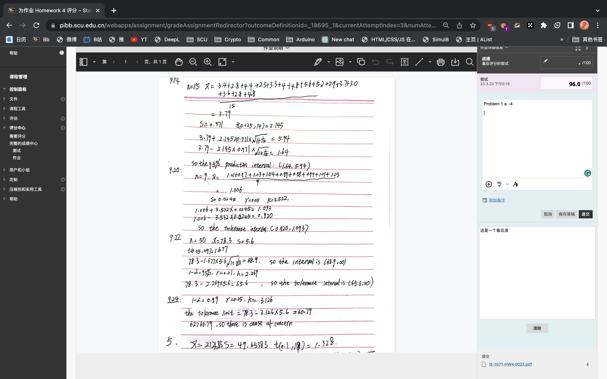

# Bb 作业批改增强 | Bb Assignment Marking Enhanced
<ul>
  <li><a href="#p1">安装</a></li>
  <li><a href="#p2">功能介绍</a></li>
  <li><a href="#p3">历史版本</a></li>
</ul>

### 安装 

1. 安装油猴软件

   **Chrome**：
   <a href="https://chrome.google.com/webstore/detail/violentmonkey/jinjaccalgkegednnccohejagnlnfdag?hl=zh-CN" target="_blank">暴力猴</a>（推荐）｜
   <a href="https://chrome.google.com/webstore/detail/tampermonkey/dhdgffkkebhmkfjojejmpbldmpobfkfo?hl=zh-CN" target="_blank">油猴</a>
    
   **Edge**：
   <a href="https://microsoftedge.microsoft.com/addons/detail/%E6%9A%B4%E5%8A%9B%E7%8C%B4/eeagobfjdenkkddmbclomhiblgggliao?hl=zh-CN" target="_blank">暴力猴</a>（推荐）｜
   <a href="https://microsoftedge.microsoft.com/addons/detail/tampermonkey/iikmkjmpaadaobahmlepeloendndfphd" target="_blank">油猴</a>

2. 安装脚本：[点击安装](https://greasyfork.org/zh-CN/scripts/462240-bb%E8%AE%A1%E7%AE%97%E5%88%86%E6%95%B0)

3. 打开Bb开始使用

### 功能介绍 
#### 扣分统计
&emsp;在“给学习者的反馈”窗口输入扣分情况。

&emsp;格式：**在“-”后输入扣的分值**。脚本会自动识别“-”符号后的扣分数字，并将扣分后的成绩填入Bb“尝试”栏中。

 
 
 
 #### 备忘录
 &emsp;进入作业批改界面时会**自动出现一个备忘录**，可以用来记录答案，便于快速批改作业。备忘录里的内容存储于本地，不会随着页面刷新而消失。
 
 

### 历史版本 
#### 1.5
更名为“Bb 作业批改增强 | Bb Assignment Marking Enhanced” 
重构了“扣分统计”部分 
新增了“备忘录”功能
优化了页面布局

#### 1.4
修复了查看已打分作业时成绩显示错误的问题  
优化了性能

#### 1.3
修复了tampermonkey下不可用的问题

#### 1.2
修复了总分一直为100的bug  
增加了初始化分值显示

#### 1.1

增加小数统计

#### 1.0

脚本发布

